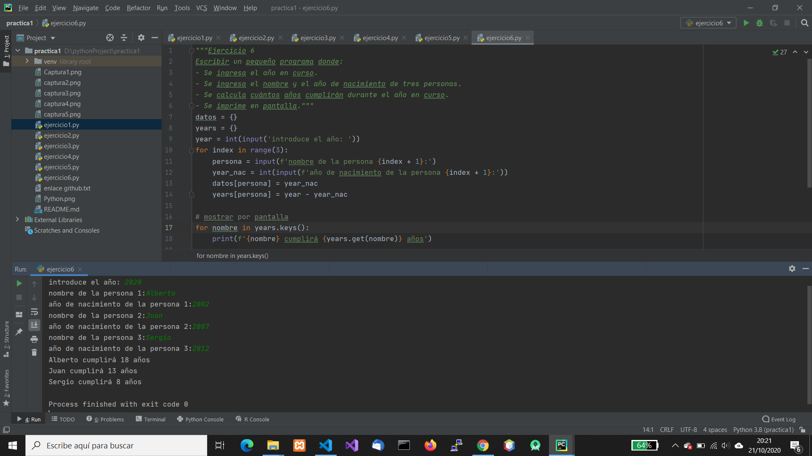
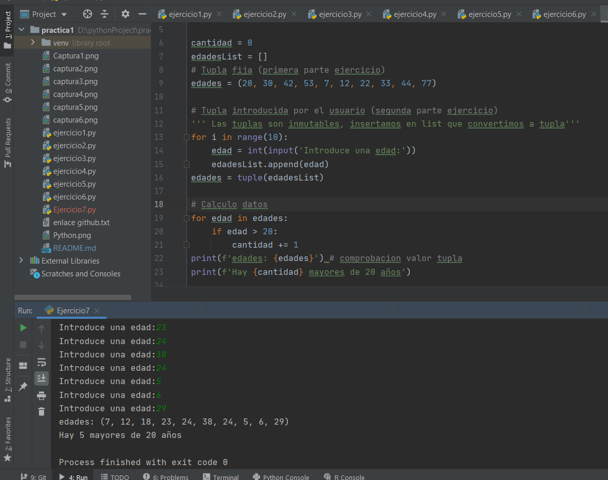
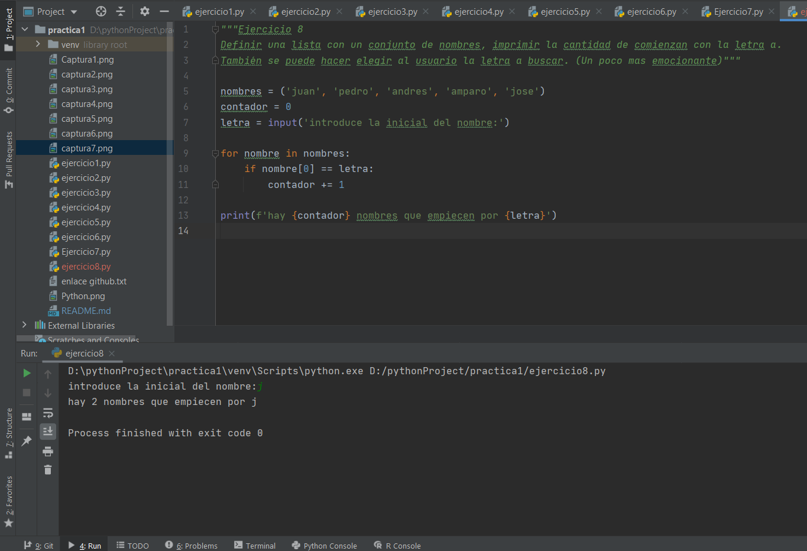
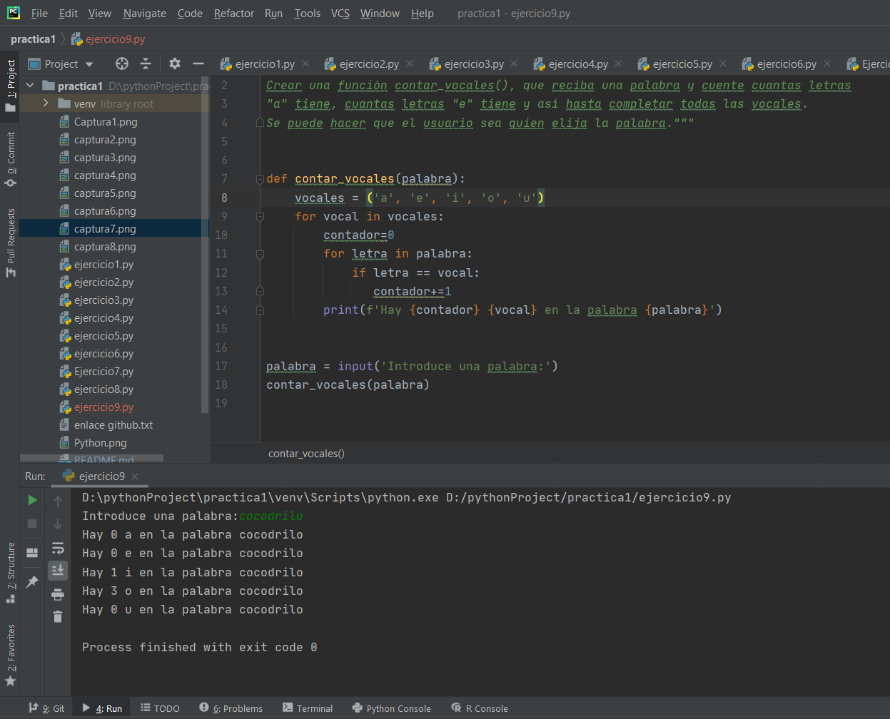
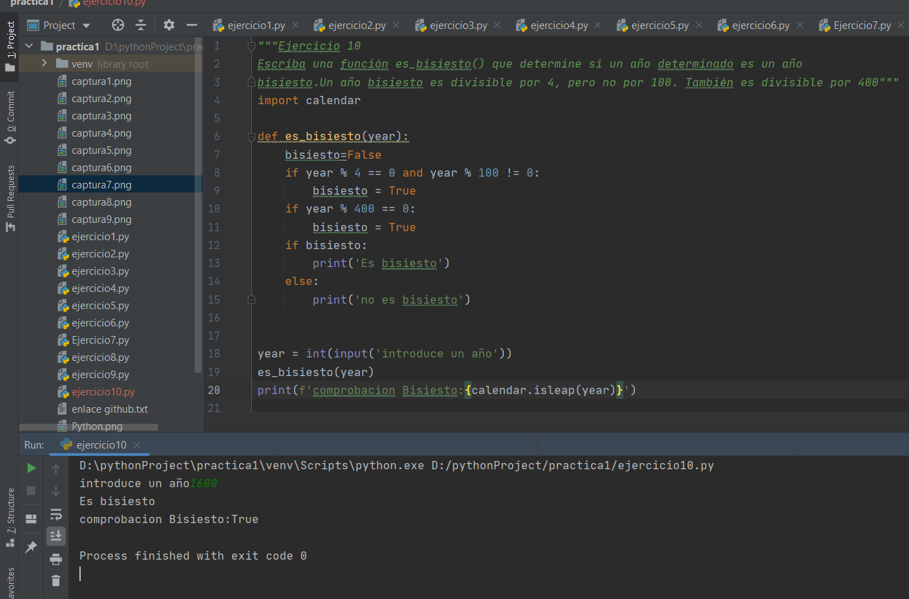

# Primeros pasos en Python 2

Ejercicios en Python

## Ejercicio 1

Escribir una función max_in_list() que tome una lista de números y devuelva el más grande.

Solucion: Asignar el maximo al primer numero (asi seguro que el maximo esta en la lista), despues comparar con el segundo y asignar el maximo, así con todos

## Ejercicio 2

Escribir una función mas_larga() que tome una lista de palabras y devuelva la más larga.

Idea de solucion: igual que ejercicio 1 pero comparando longitud. Controlando las palabras de maxima longitud

## Ejercicio 3

Escribir una función filtrar_palabras() que tome una lista de palabras y un entero n, y
devuelva las palabras que tengan más de n carácteres.

Idea: similar al 2

## Ejercicio 4

Escribir un programa que le diga al usuario que ingrese una cadena. El programa
tiene que evaluar la cadena y decir cuantas letras mayúsculas tiene.

idea: utilizar upper o lower, comprobar como cuenta caracteres no letras

## Ejercicio 5

Construir un pequeño programa que convierta números binarios en enteros.

idea: utilizar funcion int (numero, base= )

## Ejercicio 6

Escribir un pequeño programa donde:
1) Se ingresa el año en curso.
2) Se ingresa el nombre y el año de nacimiento de tres personas.
3) Se calcula cuántos años cumplirán durante el año en curso.
4) Se imprime en pantalla

## Ejercicio 7

Definir una tupla con 10 edades de personas. Imprimir la cantidad de personas con
edades superiores a 20.
Puedes variar el ejercicio para que sea el usuario quien ingrese las edades.
_Nota.- la tupla de la primera parte es machacada por la de la segunda parte_

## Ejercicio 8

Definir una lista con un conjunto de nombres, imprimir la cantidad de comienzan con
la letra a.
También se puede hacer elegir al usuario la letra a buscar. (Un poco mas
emocionante

## Ejercicio 9

Crear una función contar_vocales(), que reciba una palabra y cuente cuantas letras
"a" tiene, cuantas letras "e" tiene y así hasta completar todas las vocales.
Se puede hacer que el usuario sea quien elija la palabra.

## Ejercicio 10

Escriba una función es_bisiesto() que determine si un año determinado es un año
bisiesto.Un año bisiesto es divisible por 4, pero no por 100. También es divisible por
400

