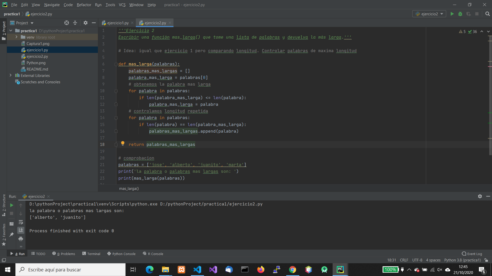

# Primeros pasos en Python 2

Ejercicios en Python

## Ejercicio 1

Escribir una función max_in_list() que tome una lista de números y devuelva el más grande.

Solucion: Asignar el maximo al primer numero (asi seguro que el maximo esta en la lista), despues comparar con el segundo y asignar el maximo, así con todos

## Ejercicio 2

Escribir una función mas_larga() que tome una lista de palabras y devuelva la más larga.

Idea de solucion: igual que ejercicio 1 pero comparando longitud. Controlando las palabras de maxima longitud

## Ejercicio 3

Escribir una función filtrar_palabras() que tome una lista de palabras y un entero n, y
devuelva las palabras que tengan más de n carácteres.

Idea: similar al 2

## Ejercicio 4

Escribir un programa que le diga al usuario que ingrese una cadena. El programa
tiene que evaluar la cadena y decir cuantas letras mayúsculas tiene.

idea: utilizar upper o lower, comprobar como cuenta caracteres no letras

## Ejercicio 5

Construir un pequeño programa que convierta números binarios en enteros.

idea: utilizar funcion int (numero, base= )

